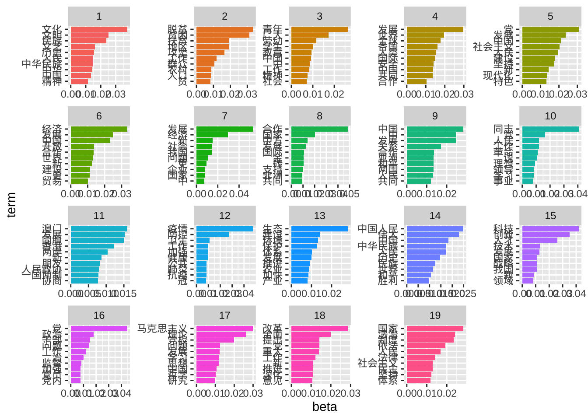
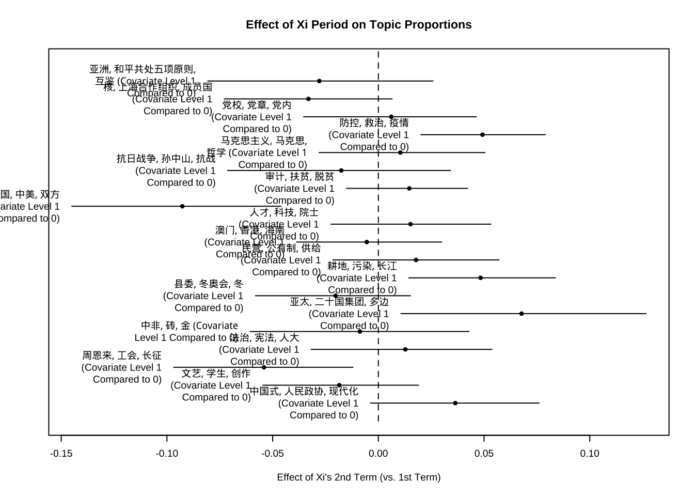
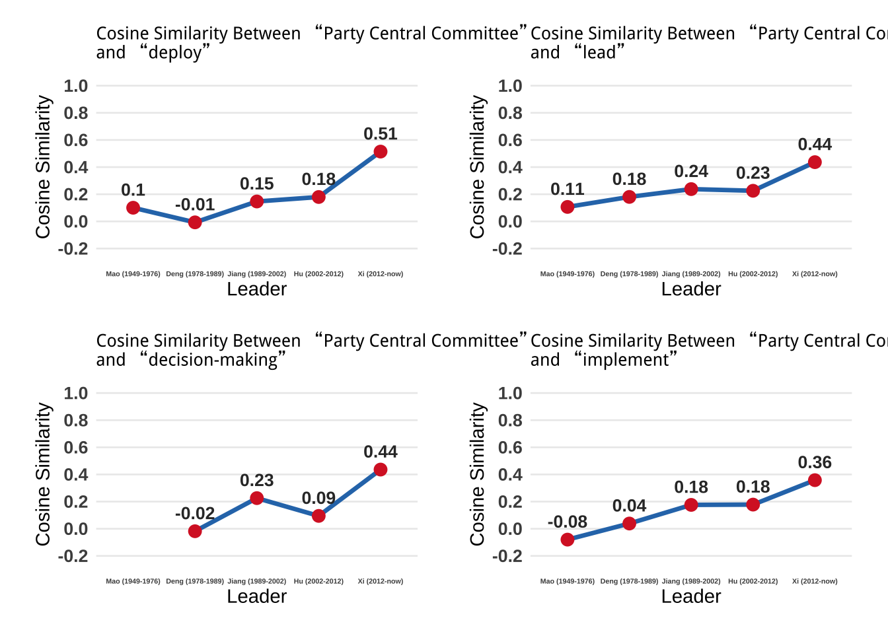

# Does President Xi Make like Mao? A Broader Historical Perspective Using TAD

This project investigates whether President Xi Jinping is imitating Mao Zedong through a computational text analysis of Chinese political discourse. The analysis combines topic modeling and word embeddings to track thematic and semantic changes over time in Xi's speeches compared to previous leaders.

[Website of The Project](https://xz634.github.io/TAD_final/)

## 📂 Directory Overview

### 📥 Key Inputs

-   `data/xispeak.csv`\
    Contains 847 documents scraped from *The Database of Xi Jinping’s Important Speech Series*.\
    *Note: These include both actual speech transcripts and news reports.*

-   `data/Mao.csv` `data/Deng.csv` `data/Jiang.csv` `data/Hu.csv` 
    Official selected works of Mao Zedong, Deng Xiaoping, Jiang Zemin, and Hu Jintao, used to construct historical word embeddings.

-   `data/xispeak_sample_labeled.csv`\
    A CSV file containing 200 manually labeled documents used to train the random forest classifier.

-   `data/cn_stopwords.txt`\
    A list of Baidu Chinese stopwords used in preprocessing and DFM construction.

### 🔧 Functionality

-   **Document Classification**
    -   A random forest model classifies documents as either *speech transcripts* or *news reports* using 30 hand-picked keyword frequencies.
    -   Manual validation achieves \~97.3% accuracy.
-   **Data Cleaning**
    -   Removes metadata noise (titles, editor names, etc.).
    -   Deduplicates documents using cosine similarity (threshold \> 0.96).
    -   Performs word segmentation using `pkuseg` in Python. The Python codes are in `code`.
-   **Topic Modeling**
    -   Applies LDA (19 topics chosen via `FindTopicsNumber()`) to provide a descriptive overview.
    -   Uses STM to model differences between Xi’s first and second term.
-   **Word Embedding Analysis**
    -   Trains separate GloVe models for each leader's corpus.
    -   Measures cosine similarity between concept pairs (e.g., "reform" vs "rule of law") to track semantic shifts across leaders.

### 📤 Key Outputs

-   `data/speech_filtered.csv`\
    Cleaned and segmented speech transcripts of President Xi, processed using `pkuseg` (Python-based tokenizer).
    
-   **Results of LDA**

Summary of 19 LDA topics identified in Xi’s speeches.

-   **Results of STM**

Three topics that saw a significant increase in proportion during Xi’s second term were COVID-19, ecological issues, and multilateral diplomacy, while two topics that declined were personal diplomacy and commemorations of key Party figures.

-   **Semantic Shifts of "Party Central Committee" (one example)**

President Xi has been consolidating power, which is specifically reflected in the decreasing semantic distance between the term “Party Central Committee” (党中央) and concepts related to political authority. The proximity of “Party Central Committee” to words such as “deploy,” “lead,” “decision-making,” and “implement” illustrates this trend.

-   `report/Final Report.docx`\
    Full research report titled *Does President Xi Make Like Mao? A Broader Historical Perspective Using TAD*.

------------------------------------------------------------------------

## 🔍 Suggested Future Improvements

-   Expand corpus beyond speeches (e.g., state media or provincial documents)
-   Include comparative analysis with reform-era leaders (Hu, Jiang) in greater depth

------------------------------------------------------------------------
